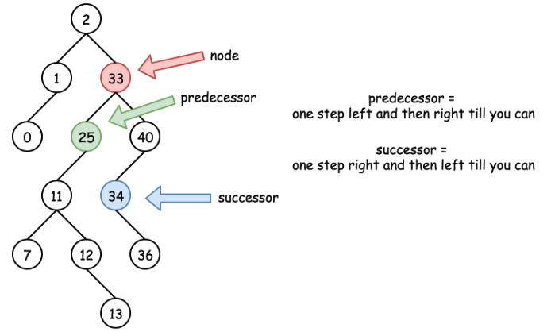

# Binary Search Tree

Binary search tree has the following characteristics:

- The left subtree of a node contains only nodes with keys **less than** the node's key.
- The right subtree of a node contains only nodes with keys **greater than** the node's key.

## [700. Search in a Binary Search Tree](https://leetcode.com/problems/search-in-a-binary-search-tree/)

**Question**: Given the `root` of a binary search tree and an integer `val`, return the subtree rooted at `val` or `None` if such `val` does not exist in the tree.

**Solution**: DFS. If `root` is `None`, return `None`. If `root.val` is `val`, return `root`. If `root.val` is less than `val`, search the right subtree. If `root.val` is greater than `val`, search the left subtree. Time complexity is `O(h)` with average `O(logn)` and worst `O(n)`, and space complexity is `O(1)`.

```python
class Solution:
    def searchBST(self, root: Optional[TreeNode], val: int) -> Optional[TreeNode]:
        while root is not None and root.val != val:
            if val < root.val:
                root = root.left 
            else:
                root = root.right
        return root
# This can be equivalently written in recursive form:
class Solution:
    def searchBST(self, root: Optional[TreeNode], val: int) -> Optional[TreeNode]:
        
        # Recursion stop condition
        if root is None or val == root.val:
            return root
        
        return self.searchBST(root.left, val) if val < root.val \
            else self.searchBST(root.right, val)
```

## [450. Delete Node in a BST](https://leetcode.com/problems/delete-node-in-a-bst/)

**Question**: Given the `root` of a binary search tree and an integer `key`, delete the node with `key` in the binary search tree. Return the root of the binary search tree after the deletion. If `key` does not exist in the binary search tree, return `None`.

**Solution**: The tricky part is to refill the node. Need to understand the idea of `predecessor` and `successor`:


The idea is to find the predecessor or successor of the node to be deleted, and replace the node with the predecessor or successor. Then we can delete the predecessor or successor. Time complexity is `O(h)` with average `O(logn)` and worst `O(n)`, and space complexity is `O(h)` to keep the recursion.

```python
class Solution:
    def deleteNode(self, root: Optional[TreeNode], key: int) -> Optional[TreeNode]:
        if not root:
            return None

        if key > root.val: # go right
            root.right = self.deleteNode(root.right, key)

        elif key < root.val: # go left
            root.left = self.deleteNode(root.left, key)

        else: # find node

            # if it's a leaf
            if not (root.left or root.right):
                root = None
            # if it has left child, find predecessor
            elif root.left:
                # replace the node value
                root.val = self.predecessor(root)
                # re-organize the tree
                root.left = self.deleteNode(root.left, root.val)

            # if it has right child, find successor
            else:
                root.val = self.successor(root)
                root.right = self.deleteNode(root.right, root.val)

        return root

    def predecessor(self, root):
        # go to very right spot of left tree
        root = root.left
        while root.right:
            root = root.right
        return root.val
    def successor(self, root):
        # go to very left spot of right tree
        root = root.right
        while root.left:
            root = root.left
        return root.val

```
