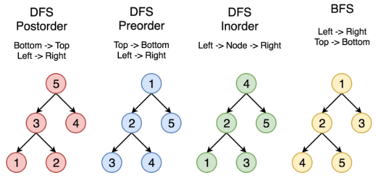
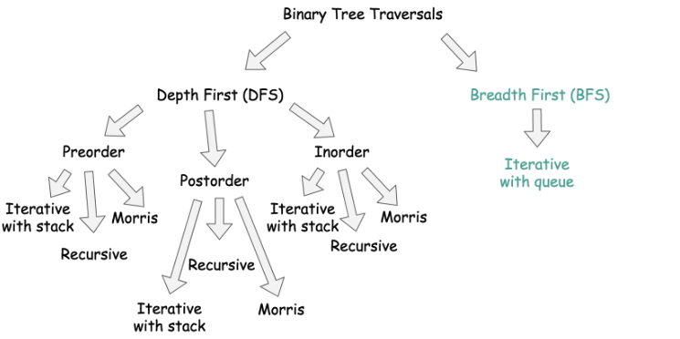

# Tree summary

The following figure shows the relationship between different tree methods.


Common tree traversal methods are shown below.


Note that inorder traversal of a BST gives the nodes in ascending order. 

## DFS - Preorder
[144. Binary Tree Preorder Traversal](https://leetcode.com/problems/binary-tree-preorder-traversal/)

Space complexity for DFS is `O(h)`, where `h` is the height of the tree. Space complexity for BFS is `O(d)`, where `d` is the diameter of the tree (the maximum width of the tree). Time complexity is `O(n)`, where `n` is the number of nodes in the tree.

```python
def preorderTraversal(self, root: Optional[TreeNode]) -> List[int]:
    tree_val = []
    def preorder(tree):
        if tree:
            # get values first
            tree_val.append(tree.val)
            # then go left
            preorder(tree.left)
            # and then go right
            preorder(tree.right)
    preorder(root)
    return tree_val
```

## DFS - Inorder
[94. Binary Tree Inorder Traversal](https://leetcode.com/problems/binary-tree-inorder-traversal/)

```python
def inorderTraversal(self, root: Optional[TreeNode]) -> List[int]:
    tree_val = []
    def inorder(tree):
        if tree:
            # go left first
            inorder(tree.left)
            # get values
            tree_val.append(tree.val)
            # then go right
            inorder(tree.right)
    inorder(root)
    return tree_val
```


## DFS - Postorder
[145. Binary Tree Postorder Traversal](https://leetcode.com/problems/binary-tree-postorder-traversal/)

```python
def postorderTraversal(self, root: Optional[TreeNode]) -> List[int]:
    tree_val = []
    def postorder(tree):
        if tree: 
            # go all the way to the left first         
            postorder(tree.left)
            # then right
            postorder(tree.right)
            # then get values
            tree_val.append(tree.val)
    postorder(root)
    return tree_val
```

## BFS - level order
[102. Binary Tree Level Order Traversal](https://leetcode.com/problems/binary-tree-level-order-traversal/)

```python
def levelOrder(self, root: Optional[TreeNode]) -> List[List[int]]:
    levels = []
    if not root:
        return levels      
    def helper(node, level):
        # node is tree root node, level is current layer
        if len(levels) == level: # initiate new level
            levels.append([])
        # append the current node value
        levels[level].append(node.val) # this is the root on this level
        # process child nodes for the next level
        if node.left:
            helper(node.left, level + 1)
        if node.right:
            helper(node.right, level + 1)   
    helper(root, 0)
    return levels
```


